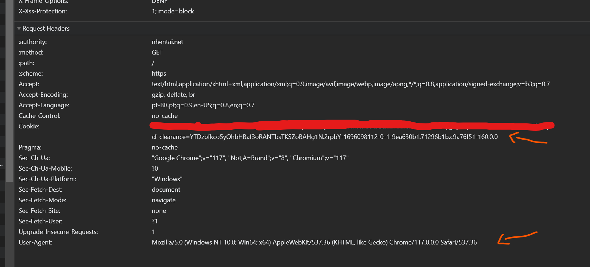

<p align="center">
    
</p>

<center>

[](https://pypi.python.org/pypi/Enma/)
[](https://codecov.io/gh/AlexandreSenpai/Enma)
[](https://www.python.org/downloads/release/python-390/)
[](https://pypi.python.org/pypi/ansicolortags/)
[](https://github.com/AlexandreSenpai/Enma)
[](https://github.com/AlexandreSenpai/Enma)
[](https://github.com/AlexandreSenpai/Enma/issues)

</center>

# Enma

Enma is a Python library designed to fetch manga and doujinshi data from many sources. It provides a unified interface to interact with different manga repositories, making it easier to retrieve manga details, search for manga, paginate through results, and fetch random manga.

## :warning: Warning
> **:exclamation: Important: Enma is not intended for mass querying or placing heavy loads on supported sources. Please use responsibly, adhering to the terms of service of the data sources. Misuse may result in service disruption or access denial.**

## Requirements

- Python 3.9+

## Installation
```py
pip install --upgrade enma
```

Ensure you have the required Python version:
```py
import sys

package_name = "enma"
python_major = "3"
python_minor = "9"

try:
    assert sys.version_info >= (int(python_major), int(python_minor))
except AssertionError:
    raise RuntimeError(f"{package_name!r} requires Python {python_major}.{python_minor}+ (You have Python {sys.version})")
```

## Documentation
You can consult full Enma documentation at <strong><a href="https://docs.minorin.io/enma" target="_blank">https://docs.minorin.io/enma</a></strong>.

## Features Comparison

Feature    | NHentai | Manganato | Mangadex
-----------|---------|-----------|-----------
search     |    ✅   |     ✅   |   ✅
random     |    ✅   |     🚫   |   ✅  
get        |    ✅   |     ✅   |   ✅
paginate   |    ✅   |     ✅   |   ✅
download   |    ✅   |     ✅   |   ✅  
author_page|    ✅   |     🚫   |   🚫   
set_config |    ✅   |     🚫   |   🚫
caching    |    ✅   |     ✅   |   ✅

## Usage

### Example 1: Using Default Available Sources

```py
from typing import cast
from enma import Enma, Sources, CloudFlareConfig, NHentai

enma = Enma[Sources]() # or just Enma()

config = CloudFlareConfig(
    user_agent='Mozilla/5.0 (Windows NT 10.0; Win64; x64) AppleWebKit/537.36 (KHTML, like Gecko) Chrome/117.0.0.0 Safari/537.36',
    cf_clearance=''
)

enma.source_manager.set_source(source_name=Sources.NHENTAI)
nh_source = cast(NHentai, enma.source_manager.source)
nh_source.set_config(config=config)

doujin = enma.random()
print(doujin)
```

### Example 2: Extending with Custom Sources
```py
from typing import cast
from enum import Enum
from enma import Enma, Manganato, IMangaRepository

class AvailableSources(Enum):
    NHENTAI = 'nhentai'
    MANGANATO = 'manganato'
    NEW_SOURCE = 'new-source'

enma = Enma[AvailableSources]()

enma.source_manager.add_source(source_name='new-source', source=Manganato()) # Source MUST be an instance of IMangaRepository
enma.source_manager.set_source(source_name=AvailableSources.MANGANATO)

manga = enma.random()
print(manga)
```

## Caching
Caching is a key feature in Enma that improves your application's efficiency by storing the results of data requests. This means when the same data is requested again, Enma can quickly retrieve it from the cache instead of repeatedly calling the external source. This results in faster response times and less strain on both your application and the external APIs.

### How Caching Benefits You
- **Speed**: Retrieving data from the cache is faster than making a new request to a manga repository.
- **Efficiency**: Reduces the number of network requests, which is especially useful when dealing with rate-limited APIs.
- **Reliability**: Provides more consistent application performance even with varying network conditions.

### Customizing Cache Settings
While Enma provides default caching settings that suit most needs, you may want to customize these settings based on your specific requirements, like how often you expect data to change or specific API rate limits.

#### Adjusting Cache Duration via Environment Variables
You can control how long data is kept in the cache by setting environment variables. This allows you to fine-tune the balance between data freshness and retrieval speed without modifying the core library code.

For example, to change the cache expiration for fetching chapters, you can set the `ENMA_CACHING_FETCH_SYMBOLIC_LINK_TTL_IN_SECONDS` environment variable:

```sh
# Sets the cache duration to 30 minutes
export ENMA_CACHING_FETCH_SYMBOLIC_LINK_TTL_IN_SECONDS=1800
```

This customization capability ensures that you can adapt the caching behavior to best fit your application's performance and efficiency needs.

By leveraging caching, Enma helps make your manga-related applications faster and more reliable, all while giving you the flexibility to tailor caching behavior as needed.

#### Available Caching TTL Settings
| KEY                                            | DEFAULT          |
|------------------------------------------------|------------------|
| ENMA_CACHING_STATE                             | enabled/disabled |
| ENMA_CACHING_FETCH_SYMBOLIC_LINK_TTL_IN_SECONDS| 100              |
| ENMA_CACHING_PAGINATE_TTL_IN_SECONDS           | 100              |
| ENMA_CACHING_SEARCH_TTL_IN_SECONDS             | 100              |
| ENMA_CACHING_GET_TTL_IN_SECONDS                | 300              |
| ENMA_CACHING_AUTHOR_TTL_IN_SECONDS             | 100              |

## Downloading Chapters
Using Enma you're able to download chapter pages to your local storage or any other storage that implements `ISaverAdapter`.

You can check it out how to do it right below:

```py
from enma import (Enma,
                  CloudFlareConfig, 
                  ManganatoDownloader, 
                  Threaded, 
                  LocalStorage)

enma = Enma()
enma.source_manager.set_source('manganato')
manga = enma.get(identifier='manga-wb999684')

downloader = ManganatoDownloader()
local = LocalStorage()

if manga:
    enma.download_chapter(path=f'./download/{manga.title.english}',
                          chapter=manga.chapters[0],
                          downloader=downloader,
                          saver=local,
                          threaded=Threaded(use_threads=True,
                                            number_of_threads=5))
```

### Using Google Drive Storage

In addition to saving chapters to local storage, Enma now supports saving chapters directly to Google Drive. This is particularly useful if you want to store your downloaded manga in the cloud for easy access across multiple devices.

#### Installation
To use the Google Drive storage option, you need to install additional dependencies:

```sh
pip install enma[google_drive]
```

#### Setting Up Credentials
You'll need to set up Google Drive API credentials to allow Enma to upload files to your Google Drive account. Follow these steps:

1. **Enable Google Drive API**:
    - Go to the Google Cloud Console.
    - Create a new project or select an existing one.
    - Navigate to APIs & Services > Library.
    - Search for Google Drive API and click Enable.
2. **Create Service Account Credentials**:
    - In the APIs & Services section, go to Credentials.
    - Click on Create Credentials > Service Account.
    - Fill in the necessary details and click Create.
    - Once the service account is created, go to it and click Keys > Add Key > Create New Key.
    - Choose JSON as the key type and download the credentials file.
3. **Share Google Drive Folder with Service Account**:
    - In Google Drive, create a new folder or use an existing one.
    - Right-click the folder and select Share.
    - Share the folder with the service account's email address (found in the credentials JSON under client_email).

#### Example Usage
Here's how you can use the GoogleDriveStorage adapter:

```python
from enma import (Enma,
                  ManganatoDownloader,
                  GoogleDriveStorage,
                  Threaded)

enma = Enma()
enma.source_manager.set_source('manganato')
manga = enma.get(identifier='manga-wb999684')

downloader = ManganatoDownloader()
google_drive_storage = GoogleDriveStorage(
    credentials_path='path/to/your/service_account_credentials.json',
    root_shared_folder='your_root_folder_id_in_google_drive'
)

if manga:
    enma.download_chapter(
        path=f'folder/subfolder/{manga.title.english}',
        chapter=manga.chapters[0],
        downloader=downloader,
        saver=google_drive_storage,
        threaded=Threaded(use_threads=True, number_of_threads=5)
    )
```

In this example:

- Replace `path/to/your/service_account_credentials.json` with the path to your downloaded service account JSON credentials.
- Replace `your_root_folder_id_in_google_drive` with the ID of the Google Drive folder where you want to save the chapters.
    - To get the folder ID, navigate to the folder in Google Drive and copy the ID from the URL (it's the string after folders/).
- The path parameter specifies the folder structure within your root Google Drive folder where the chapter will be saved.

## Logger Control
By default Enma sets logs as `SILENT`. But if you're needing to see what Enma outputs you can set log mode as `NORMAL` or `DEBUG` to deep logs.

```py
from enma import logger, LogMode

logger.mode = LogMode.NORMAL
```

## Symbolic Links
Enma normally retrieves all information about a manga, including the pages of each chapter. This process can be slow if the manga has many chapters. To speed it up, you can use symbolic links when getting a manga. This way, Enma creates a SymbolicLink instead of fetching all data immediately. You can then use this link to quickly access and fetch data for a specific chapter later.

```py
from enma import Enma

enma = Enma()

enma.source_manager.set_source('manganato')
doujin = enma.get(identifier='manga-kb951984', with_symbolic_links=True)

if doujin is not None:
    chapter_ref = doujin.chapters[0]
    chapter = enma.fetch_chapter_by_symbolic_link(link=chapter_ref.link)

```

## Retrieving `user-agent` and `cf_clearance` for NHentai

**!! THIS HAS BECOME OPTIONAL SINCE NHENTAI STOPPED REQUIRING CF_CLEARANCE COOKIES !!**

To retrieve the `user-agent` and `cf_clearance` for NHentai:

1. **Open NHentai in your browser**: Navigate to the NHentai website.
2. **Open Developer Tools**:
    - **For Google Chrome**: Right-click on the webpage and select Inspect or simply press Ctrl + Shift + I (or Cmd + Option + I on Mac).
    - **For Firefox**: Right-click on the webpage and select Inspect Element or press Ctrl + Shift + I (or Cmd + Option + I on Mac).
3. **Navigate to the Network Tab**: In the Developer Tools panel, click on the Network tab. This tab captures all network requests made by the webpage.
4. **Reload the Page**: With the Network tab open, reload the NHentai website by pressing Ctrl + R (or Cmd + R on Mac). This ensures that all network requests are captured.
5. **Select the nhentai.net Request**: After reloading, you'll see a list of files on the left side of the Network tab. Click on the first file named nhentai.net. This represents the main request to the NHentai website.
6. **Find the Request Headers**: On the right side, you'll see several tabs like Headers, Preview, Response, etc. Make sure you're on the Headers tab. Scroll down until you find a section named Request Headers.
7. **Copy the user-agent and cf_clearance**:
    - **user-agent**: This is a string that tells the server which web browser is being used. Look for an entry named User-Agent and copy its value.
    - **cf_clearance**: This is a specific cookie set by CloudFlare for security purposes. Look for an entry named cf_clearance and copy its value.


## Example:

```py
config = CloudFlareConfig(
    user_agent='Mozilla/5.0 (Windows NT 10.0; Win64; x64) AppleWebKit/537.36 (KHTML, like Gecko) Chrome/117.0.0.0 Safari/537.36',
    cf_clearance=''
)
```
> **Note**: The user-agent and cf_clearance values can change over time. If you encounter issues accessing NHentai through the Enma library, you might need to repeat the above steps to get updated values.

## Errors

While using the library, you might encounter some specific errors. Here's a description of each:

1. **InstanceError**: 
    - **Description**: Raised when an instance of an object is not of the expected type.
    - **Common Cause**: Trying to add a source that isn't an instance of `IMangaRepository`.

2. **SourceNotAvailable**: 
    - **Description**: Raised when attempting to access a source that isn't available in the defined source list.
    - **Common Cause**: Trying to set a source that hasn't been previously added.

3. **SourceWasNotDefined**: 
    - **Description**: Raised when trying to perform an action (like fetching a manga) without first defining a source.
    - **Common Cause**: Forgetting to set the source before performing an operation.

4. **ExceedRetryCount**: 
    - **Description**: Specific to the `NHentai` adapter. Raised when the `random` method fails to fetch a random doujin after several attempts.
    - **Common Cause**: Consecutive failures when trying to fetch a random doujin from NHentai.

5. **NhentaiSourceWithoutConfig**: 
    - **Description**: Raised when trying to make a request to NHentai without providing the necessary configurations.
    - **Common Cause**: Forgetting to provide the `user-agent` and `cf_clearance` when configuring the NHentai adapter.

6. **InvalidResource**: 
    - **Description**: Raised when trying to perform an action with an invalid or inexistent resource.
    - **Common Cause**: Providing an inexistent folder path to downloader.

7. **InvalidRequest**:
    - **Description**: Raised when trying to perform an action with an invalid data type.
    - **Common Cause**: Making an action with wrong parameter data type.

7. **Unknown**:
    - **Description**: Raised when was not possible to determine the error root cause.
    - **Common Cause**: Not properly handled error.

7. **NotFound**:
    - **Description**: Raised when was not possible to find the requested resource..
    - **Common Cause**: Fetching an inexistent resource.

7. **Forbidden**:
    - **Description**: Raised when trying to perform a request to the source without right credentials.
    - **Common Cause**: Making a request with no or invalid credentials.

7. **ExceedRateLimit**:
    - **Description**: Raised when trying to perform more requests than a server can handle.
    - **Common Cause**: Looping through many pages without cooling down.


When encountering one of these errors, refer to the description and common cause to assist in troubleshooting.

## Future Plans

We are actively working on introducing an asynchronous version of the Enma library to better cater to applications that require non-blocking operations. This version will be maintained in a separate repository to keep the core library lightweight. However, for ease of access and installation, you'll be able to install the asynchronous version directly using:

```bash
pip install enma[async]
```
Stay tuned for updates and ensure to check our repository for the latest advancements!
## Frequently Asked Questions (FAQ)

**Q: Can I add more sources to Enma?**</br>
A: Yes! Enma is designed to be extensible. You can add more sources by extending the `SourcesEnum` and implementing `IMangaRepository` that contains the required methods for the new source.

**Q: I'm facing issues with a specific source. What should I do?**</br>
A: Ensure you have the latest version of Enma. If the issue persists, please raise an issue on our GitHub repository detailing the problem.

**Q: How often is Enma updated?**</br>
A: Enma is updated regularly as new sources are added or when there are significant changes to existing sources.

## Contributing

We welcome contributions! If you'd like to contribute:

1. Fork the repository.
2. Make your changes.
3. Submit a pull request.

Ensure you follow the coding standards and write tests for new features.

## Disclaimer

This software is provided "as is", without warranty of any kind, express or implied. The developers and contributors of the Enma library shall not be liable for any misuse, damages, or other consequences arising from the use of this software.

It is important to emphasize that the Enma library was developed with the goal of facilitating efficient and responsible access and manipulation of data. We do not encourage or support the use of this tool for conducting mass queries or accesses that could overload, harm, or in any way negatively affect the servers or services of the supported sources.

Users of the Enma library must always follow the guidelines, terms of use, and limitations imposed by the accessed data sources. We strongly recommend the implementation of responsible rate limiting practices and obtaining appropriate permissions when necessary, to ensure that the use of the library complies with all applicable laws and regulations, in addition to respecting ethical principles of data use.

By using the Enma library, you agree to use the tool in an ethical and responsible manner, acknowledging that the developers of Enma will not be responsible for any use that violates these guidelines.

We remind you that respect for the services and APIs of the supported sources is fundamental for the sustainability and longevity of both the Enma and the services used. We value the community and the development ecosystem and encourage all users to contribute to a safer, more respectful, and collaborative digital environment.

## License

MIT
